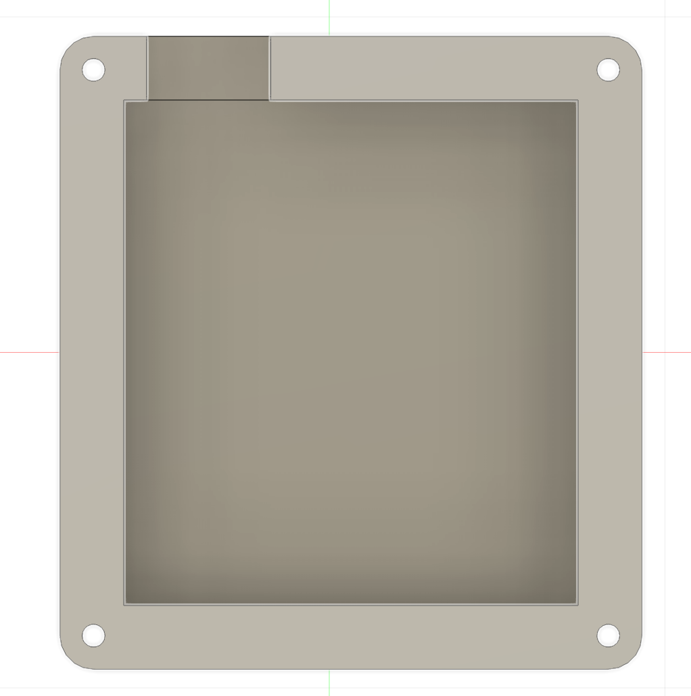
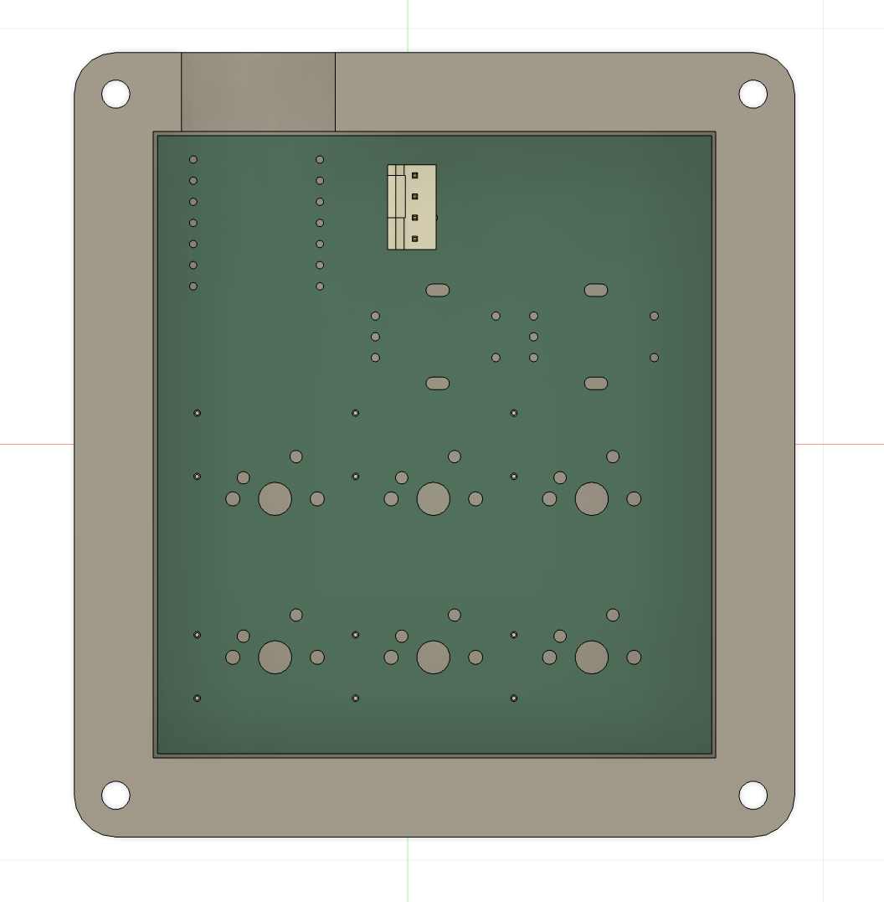
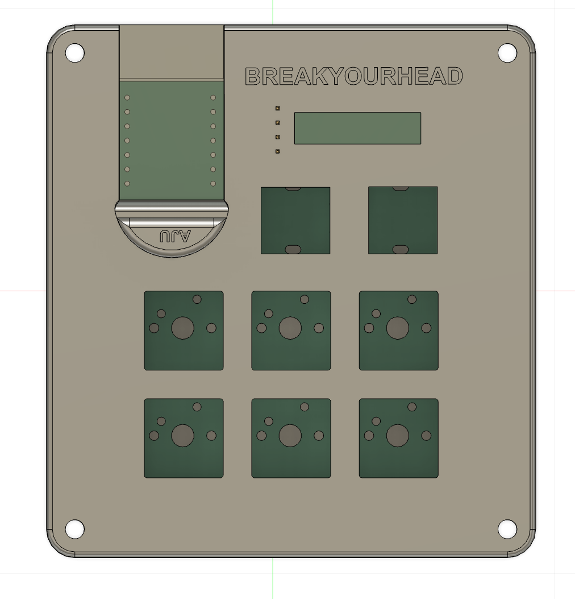
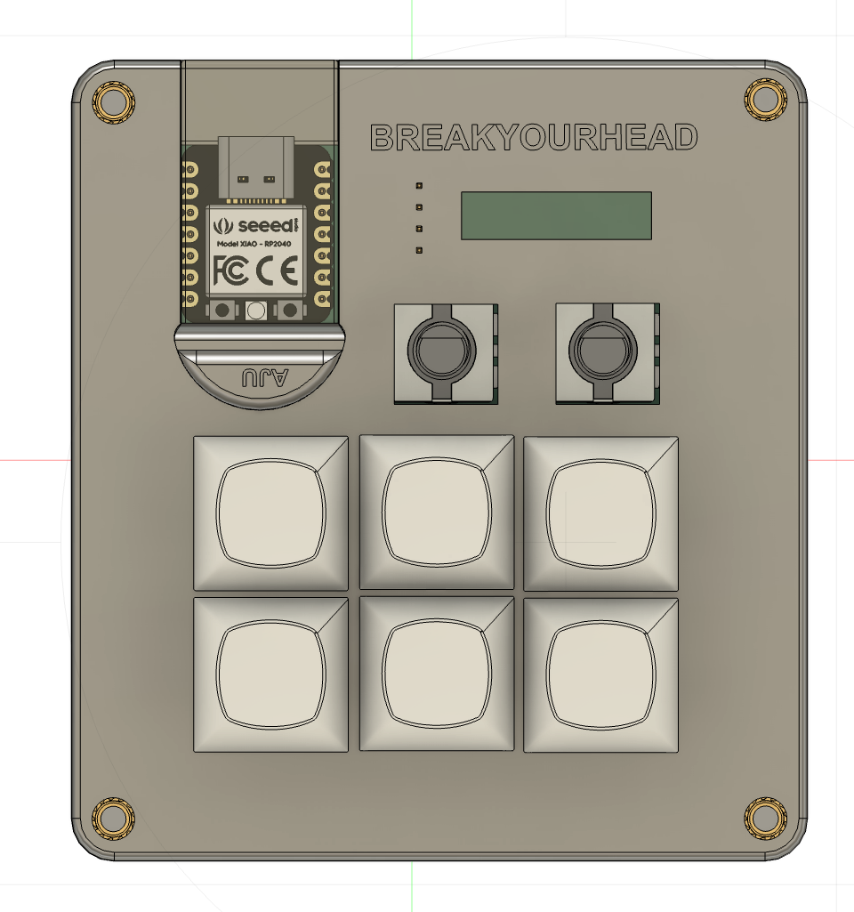
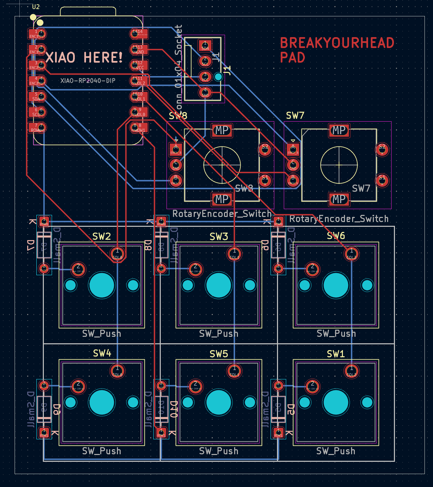
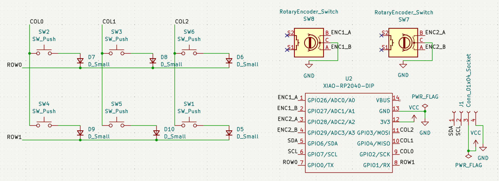

<!DOCTYPE html>
<html lang="en">
<head>
  <meta charset="UTF-8">
  <meta name="viewport" content="width=device-width, initial-scale=1.0">
  <title>BREAKYOURHEAD Pad</title>
</head>
<body>

  

    <h1>BREAKYOURHEAD Pad</h1>
    
<strong>A custom 6-key macro pad with dual rotary encoders and OLED support.</strong>

    
  
  

  

  <h2 id="bom">🛠️ Bill of Materials (BOM)</h2>

  

    <table border="1" style="border-collapse: collapse; width: 100%;">
      <thead>
        <tr style="background-color: #f6f8fa;">
          <th align="center" style="padding: 6px;">Part Name</th>
          <th align="center" style="padding: 6px;">Quantity</th>
          <th align="center" style="padding: 6px;">Specifications</th>
          <th align="center" style="padding: 6px;">Notes</th>
        </tr>
      </thead>
      <tbody>
        <tr>
          <td align="left" style="padding: 6px;"><strong>Microcontroller</strong></td>
          <td align="center" style="padding: 6px;">1</td>
          <td align="left" style="padding: 6px;">Seeed Studio XIAO RP2040</td>
          <td align="left" style="padding: 6px;">Main logic board</td>
        </tr>
        <tr>
          <td align="left" style="padding: 6px;"><strong>Display</strong></td>
          <td align="center" style="padding: 6px;">1</td>
          <td align="left" style="padding: 6px;">0.91in OLED Module</td>
          <td align="left" style="padding: 6px;">I2C Interface</td>
        </tr>
        <tr>
          <td align="left" style="padding: 6px;"><strong>Rotary Encoders</strong></td>
          <td align="center" style="padding: 6px;">2</td>
          <td align="left" style="padding: 6px;">EC11 v2</td>
          <td align="left" style="padding: 6px;">With push-button</td>
        </tr>
        <tr>
          <td align="left" style="padding: 6px;"><strong>Switches</strong></td>
          <td align="center" style="padding: 6px;">6</td>
          <td align="left" style="padding: 6px;">Cherry MX Switch Base v2</td>
          <td align="left" style="padding: 6px;">Mechanical Keys</td>
        </tr>
        <tr>
          <td align="left" style="padding: 6px;"><strong>Keycaps</strong></td>
          <td align="center" style="padding: 6px;">6</td>
          <td align="left" style="padding: 6px;">DSA 1u v2</td>
          <td align="left" style="padding: 6px;">Low profile profile</td>
        </tr>
        <tr>
          <td align="left" style="padding: 6px;"><strong>Inserts</strong></td>
          <td align="center" style="padding: 6px;">5</td>
          <td align="left" style="padding: 6px;">M3 Threaded Insert v3</td>
          <td align="left" style="padding: 6px;">Heat-set for Case</td>
        </tr>
        <tr>
          <td align="left" style="padding: 6px;"><strong>Screws (Short)</strong></td>
          <td align="center" style="padding: 6px;">2</td>
          <td align="left" style="padding: 6px;">M3x12 SHCS v1</td>
          <td align="left" style="padding: 6px;">Socket Head Cap Screw</td>
        </tr>
        <tr>
          <td align="left" style="padding: 6px;"><strong>Screws (Long)</strong></td>
          <td align="center" style="padding: 6px;">3</td>
          <td align="left" style="padding: 6px;">M3x16 SHCS v5</td>
          <td align="left" style="padding: 6px;">Socket Head Cap Screw</td>
        </tr>
        <tr>
          <td align="left" style="padding: 6px;"><strong>PCB</strong></td>
          <td align="center" style="padding: 6px;">1</td>
          <td align="left" style="padding: 6px;">Custom BYH PCB</td>
          <td align="left" style="padding: 6px;">FR4</td>
        </tr>
        <tr>
          <td align="left" style="padding: 6px;"><strong>Diodes</strong></td>
          <td align="center" style="padding: 6px;">6</td>
          <td align="left" style="padding: 6px;">1N4148</td>
          <td align="left" style="padding: 6px;">Through-hole</td>
        </tr>
      </tbody>
    </table>
  

   

  <h2>📷 Gallery</h2>

  

    
    
    
    
    
    
  

</body>
</html>
