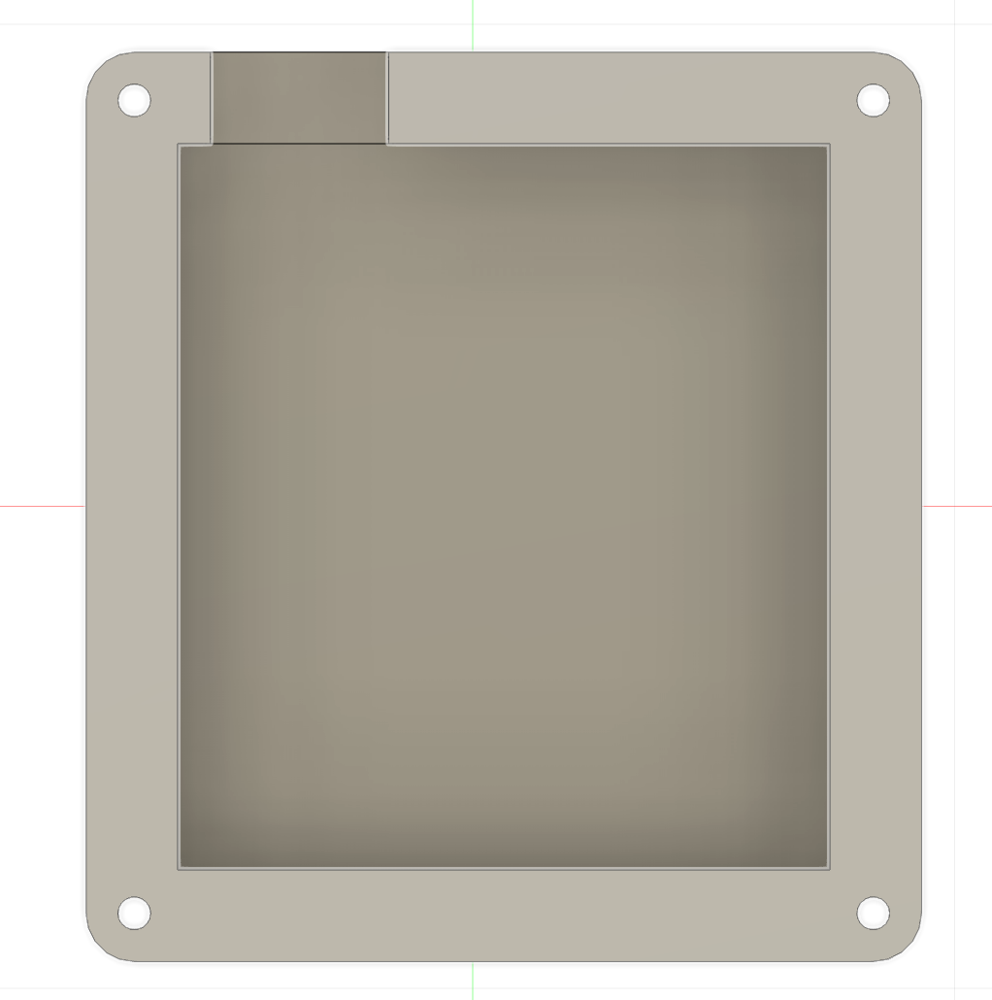
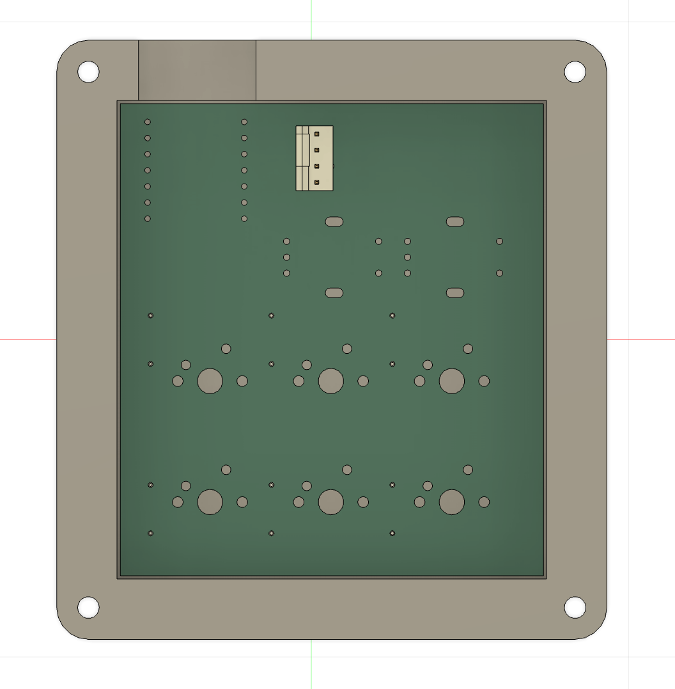
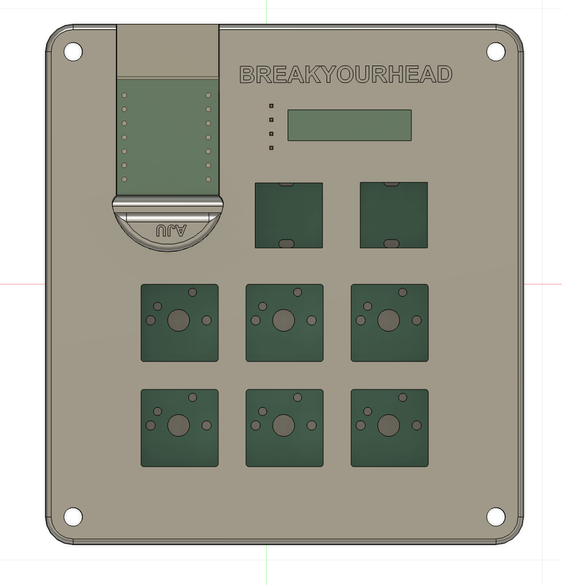
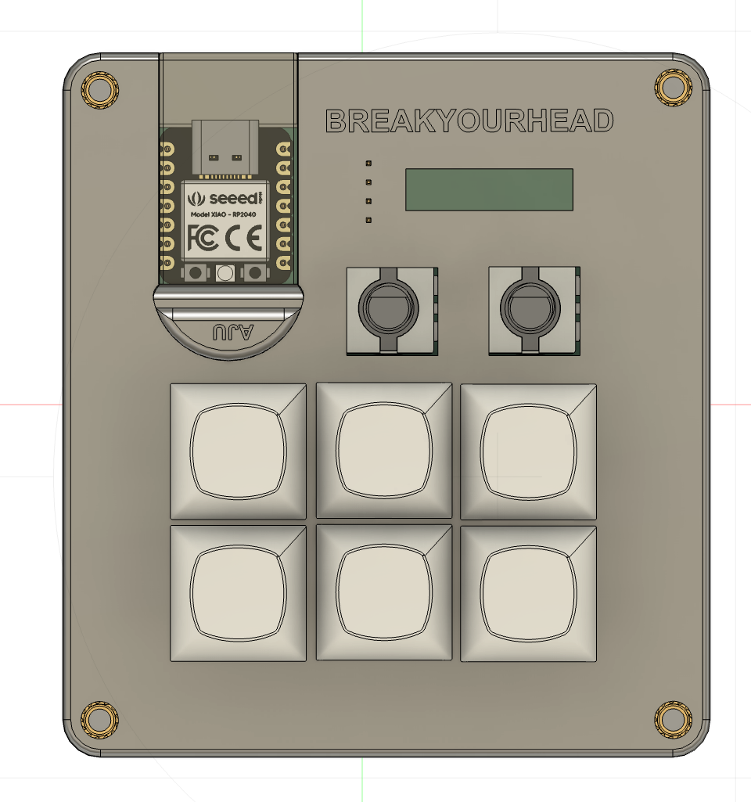
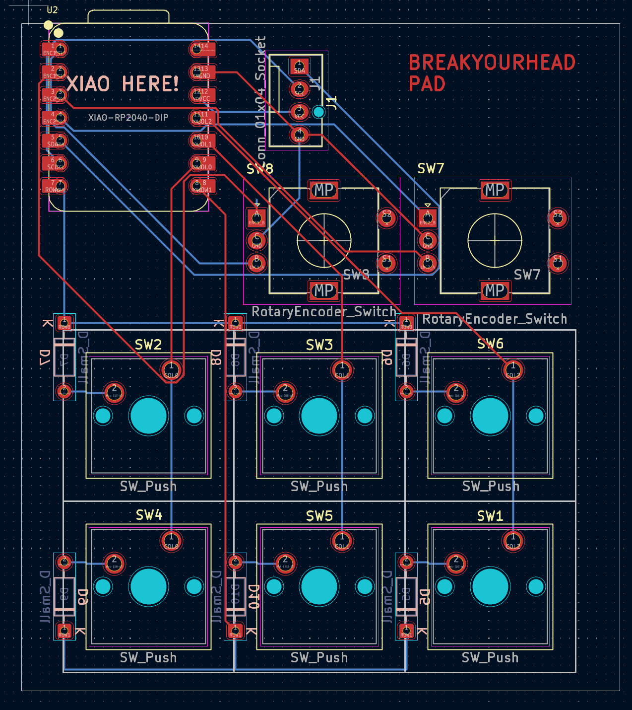
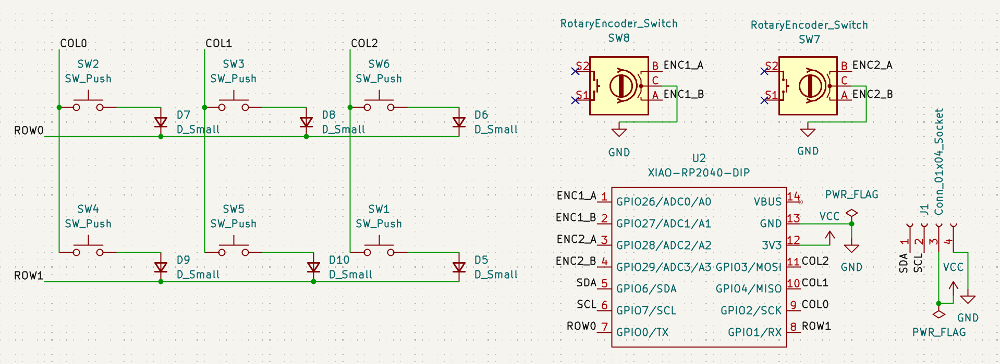

# BYH MacroPad

### A custom 6-key macropad built for professional video editing workflows.

 

---

# Overview

BYH is a compact **6-key mechanical macropad** designed specifically for video editors using applications like **Adobe Premiere Pro** and **DaVinci Resolve**.

Rather than relying on keyboard shortcuts, BYH places the most frequently used editing functions beneath your fingertips while providing two precision rotary encoders for intuitive timeline control.

The device runs **QMK Firmware**, allowing every key, encoder, and layer to be fully customizable.

---

# Features

- 6-key mechanical layout
- Dual EC11 rotary encoders
- 0.91" OLED display
- QMK Firmware
- Layer switching
- Custom PCB
- Silent linear mechanical switches
- Heavy aluminum encoder knobs
- Ergonomic 5–7° angled case
- USB-C connectivity

---

# Hardware

| Component | Specification |
|-----------|---------------|
| **Microcontroller** | Seeed Studio XIAO RP2040 |
| **Keys** | 6 × Cherry MX Mechanical Switches |
| **Encoders** | 2 × EC11 Rotary Encoders |
| **Display** | 0.91" OLED (I²C) |
| **Firmware** | QMK |
| **PCB** | Custom FR4 PCB |
| **Case** | 3D Printed |
| **Connection** | USB-C |

---

# Layers

## Layer 0 — Rough Cut

Primary editing controls.

| Control | Function |
|---------|----------|
| Keys | Cut, Ripple Delete, Undo, Redo, Play/Pause, Marker |
| Left Encoder | Timeline Scrub |
| Right Encoder | Timeline Zoom |

---

## Layer 1 — Color & Audio

Color grading and audio adjustments.

| Control | Function |
|---------|----------|
| Keys | Color Wheels, Curves, Gain, Saturation, Audio Tools |
| Left Encoder | Parameter Adjustment |
| Right Encoder | Fine Control |

---

# Bill of Materials

| Part | Qty | Specification |
|------|----:|---------------|
| Seeed Studio XIAO RP2040 | 1 | Microcontroller |
| 0.91" OLED Display | 1 | I²C |
| EC11 Rotary Encoder | 2 | Push-button |
| Cherry MX Switch | 6 | Linear |
| DSA 1u Keycaps | 6 | Low Profile |
| Custom PCB | 1 | FR4 |
| 1N4148 Diodes | 6 | Through-hole |
| M3 Heat-set Inserts | 5 | Brass |
| M3×12 SHCS Screws | 2 | Steel |
| M3×16 SHCS Screws | 3 | Steel |

---

# Gallery

---

# Why BYH?

Traditional keyboards force editors to remember dozens of shortcuts.

BYH transforms the most frequently used editing commands into dedicated tactile controls, reducing hand movement while improving speed and workflow efficiency.

---

# Future Improvements

- RGB lighting
- Wireless mode
- VIA compatibility
- Multiple OLED pages
- Application auto-detection
- Additional editing profiles

---

### Designed for creators who spend more time editing than searching for shortcuts.

